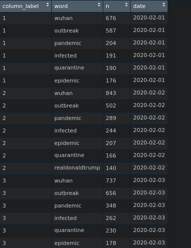
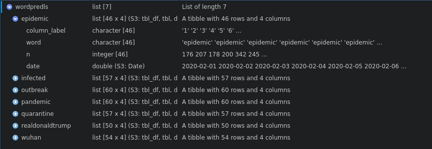
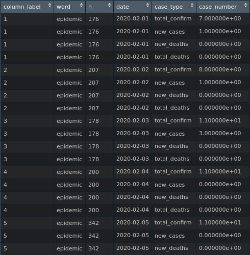
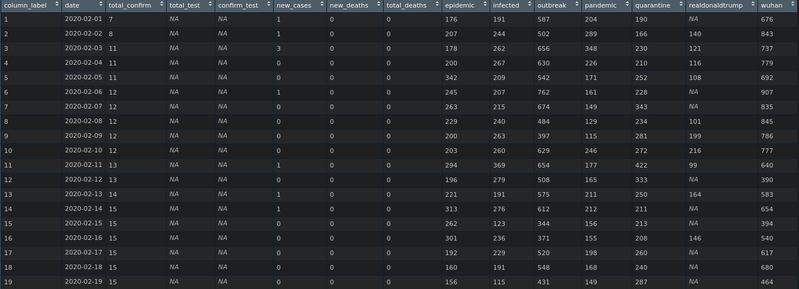
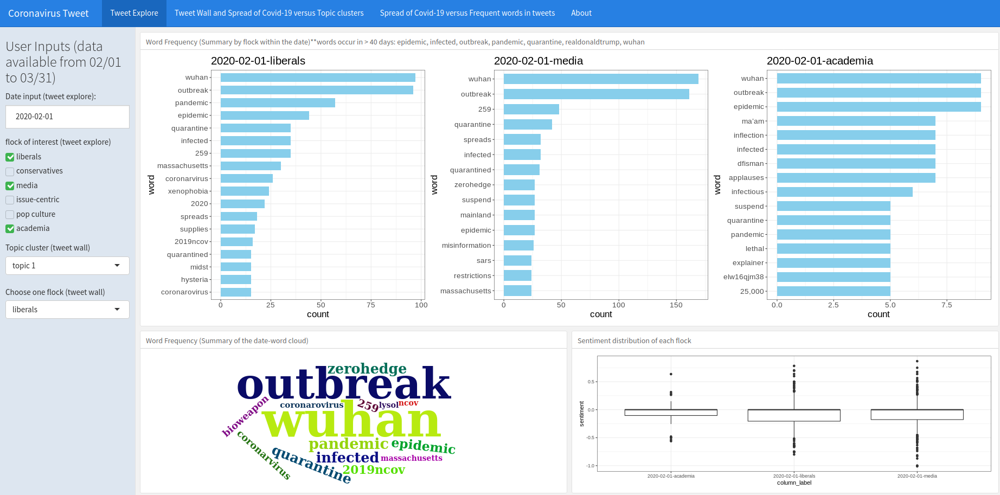
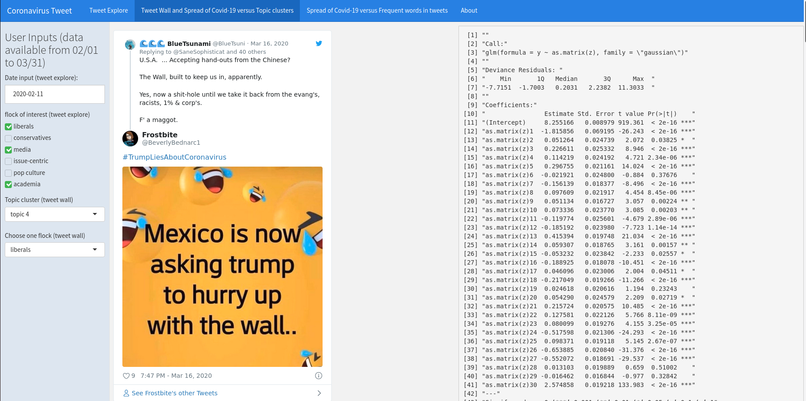
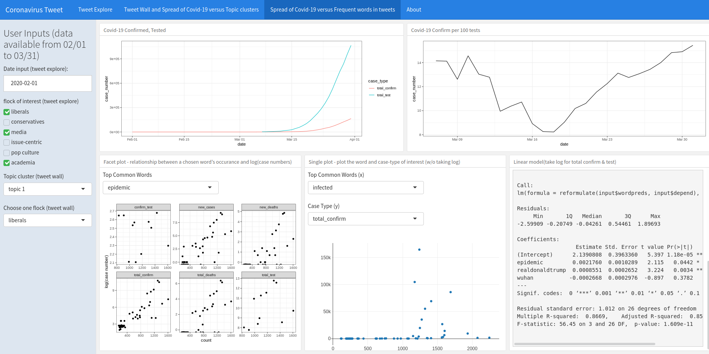

# CoronavirusTweet
Author: Sukyoung Cho & Hannah Wang  
  
The app serves to allow users to explore the tweets under #coronavirus, and plot the relationships between COVID-19 cases and tweet posts. To be more specific, it's the linear relationship that will be displayed.

Here's the app: https://hannahwang.shinyapps.io/CoronavirusTweet/

*Please refer to the "Usage" session for a smoother user experience. Due to the larger data size, please wait a second for figures to load. Or, please refresh the page when things are not showing up.*

## Introduction
Coronavirus disease (COVID-19) is an infectious disease with unprecedentedly extreme contagiousness, which is far beyond SARS or MERS. Its first outbreak was observed at Wuhan, the capital of Hubei province in China, and it is a catastrophe on a global scale. While it is spreading all over the world, the speed or the pattern of how it is transmitted varies by country. There could be factors such as the governments’ reactions that interfere with the spreading speed, but we want to delve into the social media perspective to investigate if it can predict the spread of COVID-19.
 
The initial thought is that social media is a platform where people discuss things they care about. Regarding COVID-19, there are so many online discussions every day. Thus, we are curious to examine if these discussions have anything to do with the spread of disease. In this application, tweets under the #coronavirus hashtag are used as the proxy for COVID-19 related social media discussions. As for indices of the disease spread, total confirm cases, total test cases, confirm cases per 100 tests, new cases, new deaths, and total deaths are included to let users explore. With the tweets data collected from Twitter API, and coronavirus data from Our World in Data website, we found two ways to account for the variance in the COVID-19 case numbers: one is the topic clusters of the tweets which is shown in the "Tweet Wall" tab, and the other is the frequent words within tweets, whcih is shown in the "Spread of Covid-19 versus Frequent words in tweets" tab. 

## Methods
### Data Sources & Data descriptions
1. Tweet data source: tweets were collected from Twitter API, and the twitter accounts were further divieds into flocks, the work was done by Karl's lab, which is same as the [murmuration website](https://murmuration.wisc.edu/historical/2020-05-04#event-1). 

  
*Fig. 1: Tweets data*

- Date: YYYY/MM/DD. The data was collected from Feb 1st to March 31st.

- user_id: the id of the user that tweeted.

- status_id: the id of the tweet post

- screen_name: the @name that is shown to the public. eg. @realdonaldtrump's screen name is realdonaldtrump. 

- flock_label: the cluster label that was assigned to each twitter account. There are 24 different clusters. 

- flock_category: indicates the category of clusters. There are 6 categories: liberals, conservatives, media, issue-centric, pop culture, academia
 
2. Covid-19 case data source: our complete COVID-19 dataset is a collection of the COVID-19 data maintained by [Our World in Data](https://ourworldindata.org/coronavirus). The repo for raw data can be found [here](https://github.com/owid/covid-19-data/tree/master/public/data). It is updated daily and includes data on confirmed cases, deaths, and testing. The data are updated up-to-date. We used the data of the United States only and the data ranging only from Feb 1st to March 31st to match with the twitter data. The data are mainly from the ECDC (European Centre for Disease Prevention and Control) and the WHO (World Health Organization).

  
*Fig. 2: Covid-19 case data*

- Date: MM/DD/YYYY HH:mm (24-hour format, in UTC). We used the data ranging only from Feb 1st to March 31st to match with the twitter data.

- Total_confirm: the cumulative number of confirmed cases.

- Total_test: the cumulative number of tests performed.(For U.S., data is not available until 2020-03-06)

- Confirm_test: the number of confirmed cases for every 100 tests. i.e. (Total_confirm/Total_test)*100

- New_cases: the new confirmed cases on the given date.

- New_deaths: the new deaths on the given date.

- Total_deaths: the cumulative number of deaths up to the date.


### Data Cleaning
To build the visualizations, the original datasets were converted into different forms. All codes for data cleaning are included in the dataprocessing.Rmd file, and the result of the cleaned data is available under the data/ folder.

1. Tweet Explore

- Word Frequency sessions (summary by flock within the date and summary of the date): the tweet data was splitted into two lists of dataframes, one by date(called **covid_dayls**) and one by date-flock(called **covid_dayflockls**). Then, covid_dayls and covid_dayflockls were combined into a whole list(called **covid_day_allbyflockls**). For each data frame within the covid_day_allbyflockls, retrieve the tweet text column, use unnest_token() to unnest the texts into tokens, use anti-join() to exclude the stopwords and the words that mean coronavirus(because the tweets were extracted from #coronavirus hashtag, these "coronavirus" words of course appear lots of times, which is not of our interest. We are more interested in other keywords that were frequently used), count each token's occurence, and select the top 15 words that possess the most counts(called **wordfreq_bydateflo_top15_wocoron**). The **wordfreq_bydateflo_top15_wocoron** list is eventually used in the app for visualization. Each element of the list is named with date-flock or date-all. The former represents the data for a specific date and flock, while the latter indicates all data for a specific date.

```R
#retreive text column for each dataframe
text_bydateflo_covid<-lapply(covid_day_allbyflockls, function(x){
  tibble(tweet = 1:nrow(x), text = x$text)
})

#exclude stopwords and "coronavirus", then select top15
wordfreq_bydateflo_covid<-lapply(text_bydateflo_covid, function(x){
  x %>% unnest_tokens(word, text)%>%
    anti_join(stop_words)%>%
    anti_join(mystopword)%>%
    anti_join(twitterstop)%>%
    count(word, sort = TRUE)
})
wordfreq_bydateflo_top15_wocoron<-lapply(wordfreq_bydateflo_covid, function(x){
  x %>% 
    filter(!word %in% c("coronavirus", "covid19", "covid", "coronavid19", "corona", "covid2019"))%>%
    top_n(15)
})
```
    
*Fig. 3: wordfreq_bydateflo_top15_wocoron data*

- Sentiment distribution session: to prevent R session abort, we sampled 50% of the tweet data to visualize(called **coviddayflotextls**). In order to have a more comprehensive view of the tweet sentiments, we analyze the text sentiments by sentences with the [library(sentimentr)](https://github.com/trinker/sentimentr). For each data frame within the **coviddayflotextls**, use get_sentences() to split each tweet into the sentence level, then calculate the sentences' sentiments with sentiment_by(), and the dataset is called **outls**. For each date-flock, this process will return a summary of the sentiment for the tweets within the specific date and flock, including wordcount of the tweets, standard deviation of the tweet sentence sentiments, and average sentiment, With a view to plotting the sentiment distribution for each date-flock, we use uncombin() to get the sentiment score for the tweet sentences wihtin each date-flock, and the data is called **uncombineds**. 
```R
#sample data
coviddayflotextls <- lapply(covid_dayflockls,function(x){
   df<-tibble(tweet = 1:nrow(x), text = x$text)
   sample_frac(df,0.5)
})

#sentiment analysis: https://github.com/trinker/sentimentr#plotting
library(sentimentr)
#outls is a summary of the sentiments
outls<-lapply(seq_along(coviddayflotextls),function(x){
  ds<-bind_rows(coviddayflotextls[x], .id = "column_label")
  with(ds,sentiment_by(
    get_sentences(text),
    list(column_label)))
})
uncombinout<-lapply(outls, function(x){
  uncombine(x)
})
#convert list into dataframe
uncombineds<-bind_rows(uncombinout)
```
  
*Fig. 4: outls data*

  
*Fig. 5: uncombineds data*

2. Tweet Wall

- Tweet clusters and tweet html widgets: for each flock, tweets across all 60 days were clustered into 30 topics with [library(vsp)](https://github.com/RoheLab/vsp). Before clustering, The original tweet data was first splitted by flocks (called **covid_flockls**), and unnested to tokens to create a list called **covidflottls**. An element of the **covidflottls** is a flock. Then, each dataframe of the **covidflottls** was casted into a sparse matrix. After, we use the vsp() to decrease data dimension to 30(i.e. cluster tweets to 30 topics). According to the resulted Z matrix from vsp, where the columns represented topics, and rows represented tweets(called **falsflock**), for each topic, we extracted the top 10 rows that are most strongly correlated with the topic(called **topDocXXX**, where XXX is the flock category. This matrix consists of the top 10 rows' row numbers). Then, we use the row number to obtain the correspondent tweets from **covidflock_conf** dataset (will be described in the GLM summary). Further, to get the html widget for each tweet post, for each flock's dataframe, we add a column to put embedded url. The final dataset is called **topiclsbyflowithlink**. For the data cleaning in this session, sometimes lapply was not used to avoid session run-out.

```R
#split the original tweet data(called covidds) by flock
covid_flockls<-split(covidds,f=covidds$flock_category)[1:6]
#extract text by flock
covidtextls <- lapply(covid_flockls,function(x){
   tibble(tweet = 1:nrow(x), text = x$text)
})
#unnest text into tokens
covidflottls <- lapply(covidtextls, function(x){
  x %>% unnest_tokens(word, text)
})

#create cast_sparse for each flock, didn't use lapply, 'cause it'll cause session runout
dtliberal<-cast_sparse(covidflottls[["liberals"]],tweet,word)
dtconser<-cast_sparse(covidflottls[["conservatives"]],tweet,word)
dtmedia<-cast_sparse(covidflottls[["media"]],tweet,word)
dtissue<-cast_sparse(covidflottls[["issue-centric"]],tweet,word)
dtpop<-cast_sparse(covidflottls[["pop culture"]],tweet,word)
dtacademia<-cast_sparse(covidflottls[["academia"]],tweet,word)

#vsp for each flock
faliberal<-vsp(dtliberal,k=30)
faconserv<-vsp(dtconser,k=30)
famedia<-vsp(dtmedia,k=30)
faissue<-vsp(dtissue,k=30)
fapop<-vsp(dtpop,k=30)
faacademia<-vsp(dtacademia, k=30)
#make the fa into a list
falsflock<-list(faliberal,faconserv,famedia,faissue,fapop,faacademia)
names(falsflock)<-c("liberals","conservatives","media","issue-centric","pop culture","academia")

#find correspondent tweets
topTweets = 10
topDoclib<-faliberal$Z %>% apply(2, function(t) which(rank(-t, ties.method = "random") <= topTweets))
topDoccons<-faconserv$Z %>% apply(2, function(t) which(rank(-t, ties.method = "random") <= topTweets))
topDocmedia<-famedia$Z %>% apply(2, function(t) which(rank(-t, ties.method = "random") <= topTweets))
topDocissue<-faissue$Z %>% apply(2, function(t) which(rank(-t, ties.method = "random") <= topTweets))
topDocpop<-fapop$Z %>% apply(2, function(t) which(rank(-t, ties.method = "random") <= topTweets))
topDocacademia<-faacademia$Z %>% apply(2, function(t) which(rank(-t, ties.method = "random") <= topTweets))
#make the topDoc into a list
topDocflock<-list(topDoclib,topDoccons,topDocmedia,topDocissue,topDocpop,topDocacademia)
names(topDocflock)<-c("liberals","conservatives","media","issue-centric","pop culture","academia")

#get the correspondent tweets
topiclsbyflo<-lapply(seq_along(topDocflock), function(i){
  df<-topDocflock[[i]]
  txtdf<-covidflock_conf[[i]]
  ls<-list()
  for(j in 1:ncol(df)){
    name<-paste("topic", j)
    ls[[j]]<-tibble(tweet = txtdf$text[df[,j]], status_id=txtdf$status_id[df[,j]],screen_name=txtdf$screen_name[df[,j]])
    names(ls)[j]<-name
  }
  return(ls)
})

#paste twitter link to each dataframe
#get_embed url of twitter post
get_embed <- function(status_id){
  api_result <- httr::GET(paste0(
    "https://publish.twitter.com/oembed?url=https%3A%2F%2Ftwitter.com%2FInterior%2Fstatus%2F",
    status_id))
  api_content <- httr::content(api_result)
  html_content <- api_content[["html"]]
  
  return(html_content)
}
topiclsbyflowithlink<-lapply(topiclsbyflo,function(ls){
  lapply(ls, function(topic){
    topic%>%
      mutate(status_url=paste0("https://twitter.com/",screen_name,"/status/",status_id))%>%
      mutate(embed_url=map(status_id,get_embed))
  })
})
```
  
*Fig. 6: topiclsbyflowithlink data*

- Generalized Linear Model summary: the glm() takes the log(total_confirm_cases) as y, and the Z matrices from vsp as predictors (i.e. each flock's 30 topics). Therefore, we did log transformation on the "total_confirm" case number from the original covid-19 case data, along with the date of the observations, to construct a **logtotalconf** dataframe. Then we joined this **logtotalconf** with the **covid_flockls** tweet data to create a **covidflock_conf** data that contains both case numbers and tweets. To build the glm for each flock, we lapplyed through **covidflock_conf**, for each element, set log(total_confirm_cases) as y and take the correspondent Z matrix in **falsflock** from vsp as predictors. The final cleaned data set is called **glmls**. To reduce data size, we only put the output summary table (called **glmoutput**) on the shiny app.   

```R
#covidflock dataset combined with log total confirm number
covidflock_conf<-lapply(covid_flockls, function(x){
  x%>%left_join(logtotalconf,by="date")
})

#glm of log(totalconfirm)~each topic
glmls<-lapply(seq_along(covidflock_conf),function(x){
  y<-covidflock_conf[[x]]$log_conf
  z<-falsflock[[x]]$Z
  glm(y~as.matrix(z),family="gaussian")%>%summary
})
#store the output table
glmoutput<-lapply(glmls, function(x){
  capture.output(x)
})
```

  
*Fig. 7: logtotalconf data*  
  
*Fig. 8: covidflock_conf data*  
  
*Fig. 9: falsflock data*  
  
*Fig. 10: glmls data*  

3. Spread of Covid-19 v.s. frequent words: in this tab, two forms of dataset were used, one was tidy form for ggplot, and the other was untidy form for constructing linear models. To link the Covid-19 case numbers with the tweet words mentioned in the first tab, we used the **wordfreq_bydateflo_top15_wocoron** dataset to find words that make the top-list in more than 40 days. Then we filtered the dataset to make it only contain these top frequent words, and their counts on each date (the data is called **dswithwordpred**). After, this **dswithwordpred** was splitted into a list of dataframes by these words, called **wordpredls**. With a view to using these words as predictors and regress with different types of case numbers, including "total_confirm","total_test","confirm_test","new_cases","new_deaths",and "total_deaths". we joined the  **wordpredls** with covid-19 case datasets (in the following code they are called **covidusspreadsel** and **covidus_casedeathsel**, the former consists of "total_confirm","total_test","confirm_test", while the latter contains "new_cases","new_deaths",and "total_deaths"), and then convert the dataframe into tidy(**tidypredcovds**) and untidy form(**lmformds**).

```R
wordfreq_bydateflo_top15_wocoron<-readRDS("wordfreq_bydateflo_top15_wocoron.rds")
all60topwordls<-wordfreq_bydateflo_top15_wocoron[1:60]
summaryls<-lapply(seq_along(all60topwordls), function(x){
  df<-all60topwordls[[x]]%>%mutate(date=names(all60topwordls[x]))
})
summaryds<-bind_rows(summaryls,.id="column_label")
wordoccur40<-summaryds%>%group_by(word)%>%filter(n()>40)
#the words that make the top-list in more than 40 days
thewords<-wordoccur40%>%group_by(word)%>%summarise(count=n())
wordpredictors<-thewords$word
dswithwordpred<-wordoccur40%>%filter(word %in% wordpredictors)%>%mutate(date=as.Date(date))

#split dswithwordpred by the words
wordpredls<-dswithwordpred%>%group_by(word)%>%group_split()
names(wordpredls)<-wordpredictors

#join wordpredls with covid case numbers
wordpredcov<-lapply(wordpredls, function(x){
  x %>% left_join(covidusspreadsel)%>%left_join(covidus_casedeathsel)
})
wordpredcovds<-bind_rows(wordpredcov)

#tidy form for ggpplot
tidypredcovds<-wordpredcovds%>%pivot_longer(cols = c("total_confirm","total_test","confirm_test","new_cases","new_deaths","total_deaths"),names_to = "case_type",values_to = "case_number")%>%drop_na()

#untidy form for linear model
lmformds<-wordpredcovds%>%group_by(date)%>%pivot_wider(names_from = word,values_from = n)
```
  
*Fig. 11: dswithwordpred data*

  
*Fig. 12: wordpredls data*

  
*Fig. 13: tidypredcovds data*

  
*Fig. 14: lmformds data*

### Statistical Techniques

1. Tweet Explore: descriptive statistics. For word frequencies, sum is used, as for sentiment distribution, boxplot(i.e. quantiles were used).

2. Tweet Wall: vsp for clustering, and linear model for examine if the topics are significant for explaining the variance in the log(total confirm case). We choose vsp instead of pca because vsp rotates the axes, which make the result more interpretable; as for the linear model, because the app serves as an exploratory purpose, linear model is easier for users to interpret. 

3. Spread of Covid-19 v.s. frequent words: linear model, reason is same as above.

## Usage of the App

1. Tweet Explore

Please choose the date input first, and then choose a flock that you are intered in. Then you'll see the visualizations dynamically change. In the "Word Frequency (Summary by flock)" session, it displays the top 15 tweet words that exist within the specified date-flock. In the "Word Frequencey (Summary of the date)" session, it displays the top 15 tweet words on that date (regardless of flocks). The "sentiment distribution" displays with boxplots. The box contains first, second, and third quantiles, and the dots are outliers.  
(If nothing displays, please click on any date and flock of interest to trigger the plot to re-render)

2. Tweet Wall

Please select a topic and a flock to see the tweet posts that were clustered into the topic. Then the user will see the correspondent glm summary table for that flock. Each as.matrix(z)1, 2, 3... represents a topic, i.e. as.matrix(z)1 is topic 1, as.matrix(z)2 is topic 2. The y in the model represents the log transformation of the total confirm case. The tweets and summary table are constructed with the data across 60 days, i.e., the unit of analysis is a day. There may be some duplicate tweets with different time stamp, or because the tweets' status ids are different, they are still all included.  Or if the tweet posts are missing, it may mean that they were deleted, so the html widget could not obtain the post. 

3. Spread of Covid-19 v.s. frequent words

Under this tab, users are able to see plenty of graphics. On the top-left side, the graph displays the cumulative number of confirmed cases and the cumulative number of tests performed along the timeline, which serves to represent the trend of the pandemic. The graph next to it shows the change of confirmed case per 100 tests with time, which can be a good indicator for the spread of Covid-19. On the bottom-right and bottom-center, users are able to explore the graphs with variables that they might be interested in. Facet plot is for users who are interested in all attributes and want to see everything at a glance. The user can choose the word to see its relationship with each type of case numbers. Each dot represents a day, and all case numbers are log transformed. Next to it is the "Single plot", it allows users to zoom in a single word(predictor) and a single case type(dependent variable), and the case numbers in the zoomed-in single plot does not take log transformation. On the bottom-right, users are able to explore the statistical model to estimate the predictions based on the linear model. Using a check box, readers can choose predictors and the dependent variable they want to predict. The words used as predictors are the most frequent words that appeared in more than 40 days. We took a log for Total_confirm and Total_test variables to make them less leveraging, as they are increasing exponentially.

## Results

Here, we will present an example result for each tab.
  
1. Tweet Explore

Here is an example that we choose February 1stat date, and flocks of interests are "liberals", "media", and "academia". The top row shows the top 15 words for each flock on that date, and the bottom left shows the summary of top words' frequencies for all 6 flocks on that date. As is shown in the plots, there are several words that make the list for all flocks, such as "outbreak" and "wuhan". However, there are also flock-specific words, for example, "sars" and "misinformation" only occurs in media flock. The reason may be that they are in charge of delivering information, and compare covid-19 with sars to let the audience be more aware of the disease. The bottom right is the sentiment distribution for the flocks we chose. For the three flocks we chose, 75% of the tweets' sentiments are below 0, and tweets from academia seemed to have a rather centralized sentimental distirubtion. 

  
*Fig. 15: Tweet explore example*

2. Tweet Wall

Here is an example that we choose topic 4 of liberals. If you scroll through, it's mainly talking about how Trump deals with Covid-19. In the summary table, it is shown that, for tweets within liberals flock, topic 1-5, topic 7-18, topic 20-27 and topic 30 are all siginificant for explaining the variance in log(total confirm case numbers). Looking through some of the significant topics, for example, topic 10 seems to be talking about the spread of Covid-19 within U.S. Topic 11 seems to be talking about WHO.

  
*Fig. 16: Tweet wall example*

3. Spread of Covid-19 v.s. frequent words

For "facet plot", we choose "epidemic" as the x. The x axis represents the count of the word's occurence, y represents log transformation of the case numbers, and each dot is a date. Overall, while the frequency of "epidemic" increases, the log(total_confirm), log(new_cases), and log(total_deaths) increases as well. For the "single plot", we choose infected as the predictor, and total_confirm as response. However, because in the end of March, the case numbers started to increase exponeentially, which makes other points look close to zero, resulting in the no-trend plot. This verify the fact that for total confirm case numbers, we may need to take a log transformation if we want to construct a linear model. For the "Linear model" session, we choose epidemic, realdonaldtrump, and wuhan as predictors, and log(total_confirm) as response. According to the summary table, epidemic and realdonaldtrump are significant-positvie correlated with log(total_confirm), and according to the adjusted R-squared, the predictors altogether account for around 85% of the variance in log(total_confirm).


*Fig. 17: Spread of Covid-19 v.s. Frequent words in tweets example*

## Conclusions

The main goal of the app was showing users how tweet words and posts are related with the trend of Covid-19's spread. From our test examples, it is shown that the tweets, both in word token level and in topic level can significantly explain the variance in covid-19 case numbers, and the most obvious trend exists when the dependent variable is log transformation of total confirmed cases. The limitation of the app is that, so far we only included data until March 31st, but there are many more cases after April, which can be interesting to explore as well. Moreover, regarding the tweet posts, there are some tweets that contain duplicate contents but different status ids, and we did not exclud these duplicates. For future work, it may be more interesting analyze only on the unique posts.
